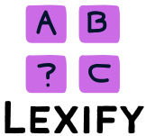

# Lexify - The Engaging Word Learning Game
---

Welcome to Lexify! An interactive Android word guessing game designed to make learning new vocabulary fun and engaging. Lexify challenges players to guess words based on clues, with a strong emphasis on understanding word meanings, synonyms, and usage contexts.

The game aims to gradually increase in difficulty, starting with a base of levels (e.g., 100 levels planned), where earlier levels might feature fewer words to guess (e.g., 4 words for the first 10 levels) and complexity increases over time.

<div style="clear: both;"></div>

## ✨ Features

*   **Engaging Word Guessing:** Solve word puzzles based on descriptive clues.
*   **Educational Focus:** Learn new words, their meanings, synonyms, and contextual usage.
*   **Progressive Difficulty:** Levels become more challenging as you advance.
*   **Hints & Give Up:** Stuck on a word? Use hints or choose to reveal the word and learn from it.
*   **Post-Game Learning:** Option to review definitions and details of words you've encountered.
*   **Player Profile & Stats:** Track your progress, games played, words guessed, average time, and success rate.
*   **Levels System:** Advance through numerous levels, each with a set of words to discover.
*   **Achievements:** Unlock milestones and showcase your word prowess.
*   **Intuitive UI:** Clean and user-friendly interface for a smooth gaming experience.
*   **Customization:** Personalize your player name and avatar.

## 📲 Installation Guide

There are a couple of ways to install Lexify on your Android device:

**1. Using the APK (Recommended for most users):**

*   **Download:** If an `.apk` file is provided (e.g., in the "Releases" section of this repository or from a direct link), download it to your Android device.
*   **Enable Unknown Sources:**
    *   Go to your device's **Settings**.
    *   Navigate to **Security** or **Apps & notifications** > **Special app access** > **Install unknown apps**. (The exact path may vary depending on your Android version and manufacturer).
    *   Find your browser or file manager app and allow it to install apps from unknown sources.
*   **Install:** Open your file manager, locate the downloaded `.apk` file, and tap on it to begin the installation. Follow the on-screen prompts.

**2. Building from Source (For developers):**

*   **Prerequisites:**
    *   Android Studio (latest stable version recommended)
    *   Git
*   **Clone the Repository:**
    ```bash
    git clone https://github.com/Jasmine-Afrem/Lexify.git
    cd Lexify
    ```
*   **Open in Android Studio:**
    *   Launch Android Studio.
    *   Select "Open an existing Android Studio project."
    *   Navigate to the cloned `Lexify` directory and open it.
*   **Build and Run:**
    *   Let Android Studio sync the project and download any necessary dependencies.
    *   Connect an Android device or start an emulator.
    *   Click the "Run" button (green play icon) in Android Studio.

## 📸 Screenshots

Here's a glimpse of Lexify in action:

| Home Screen                                  | Navigation Menu                             | About Lexify                                |
| :-------------------------------------------: | :------------------------------------------: | :------------------------------------------: |
| 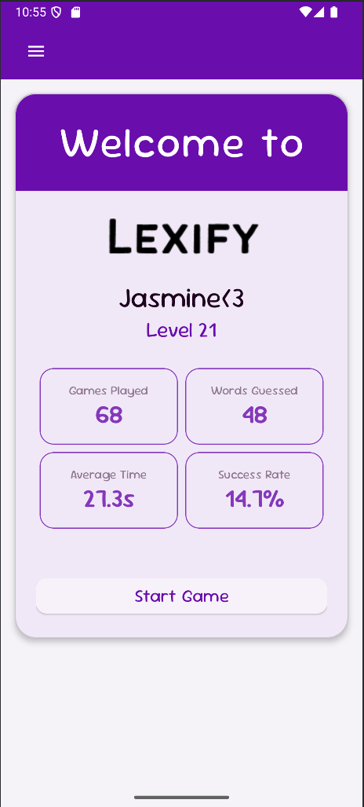         | 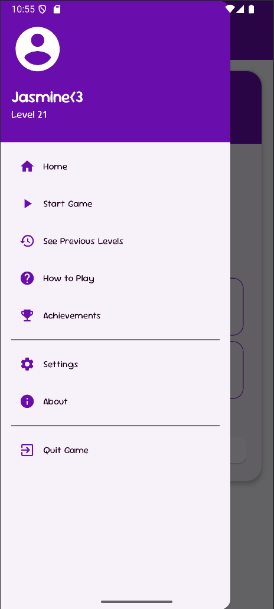     | 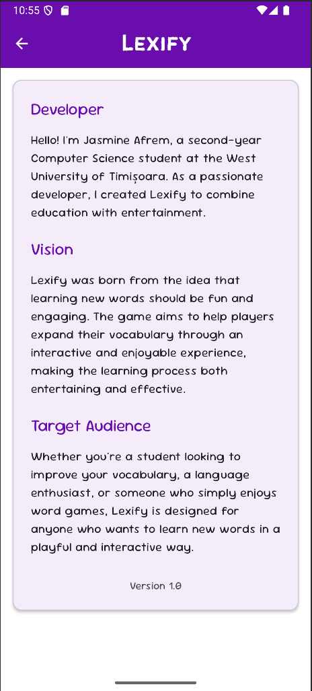       |

| Settings                                     | Achievements                                 | How to Play                                 |
| :-------------------------------------------: | :------------------------------------------: | :------------------------------------------: |
| 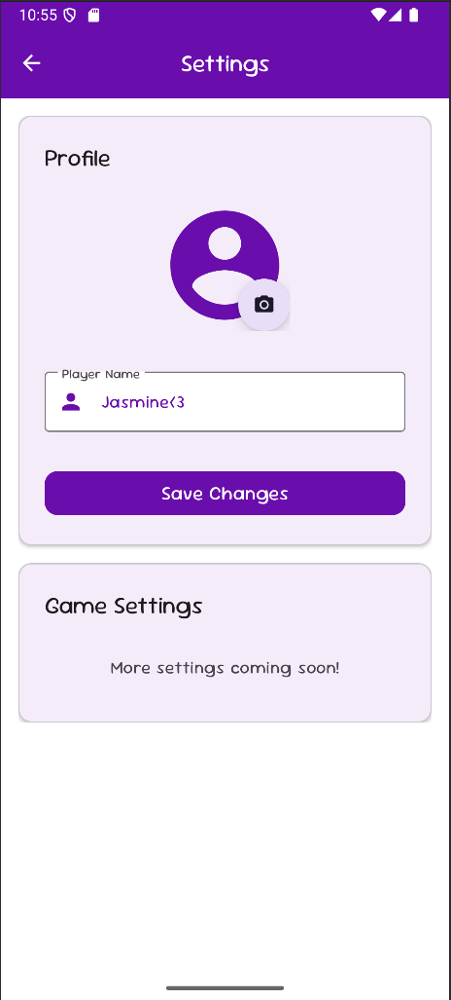        | 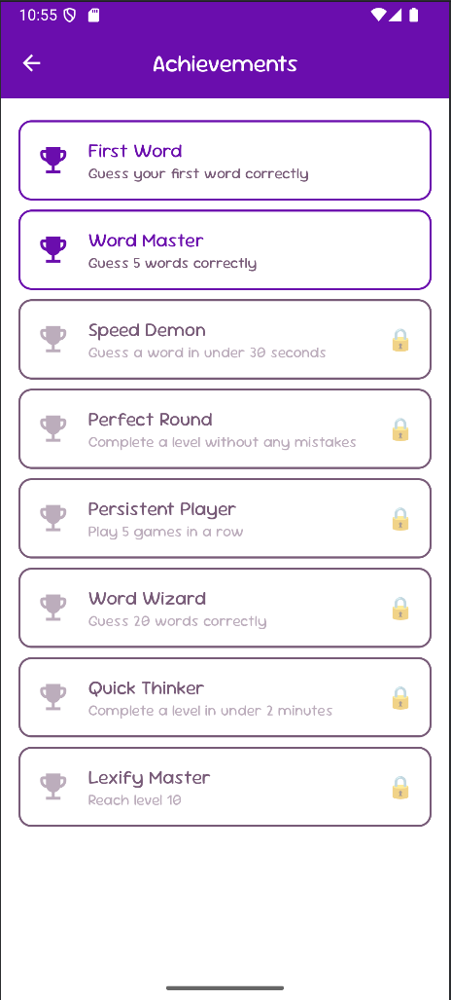| 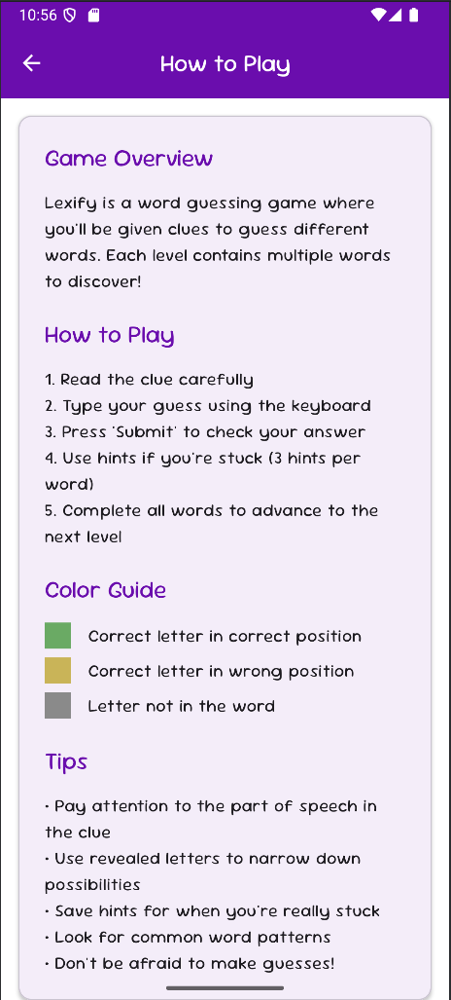  |

| Previous Levels                              | Gameplay - Incorrect Guess                   | Gameplay - Correct Guess                    |
| :-------------------------------------------: | :------------------------------------------: | :------------------------------------------: |
| 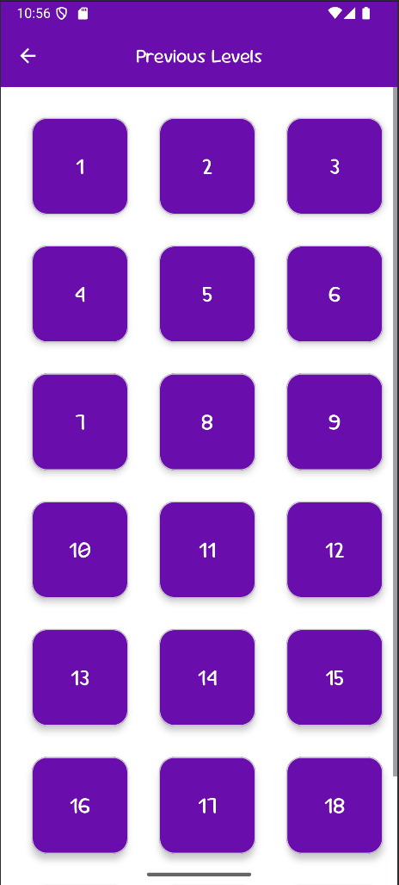   | 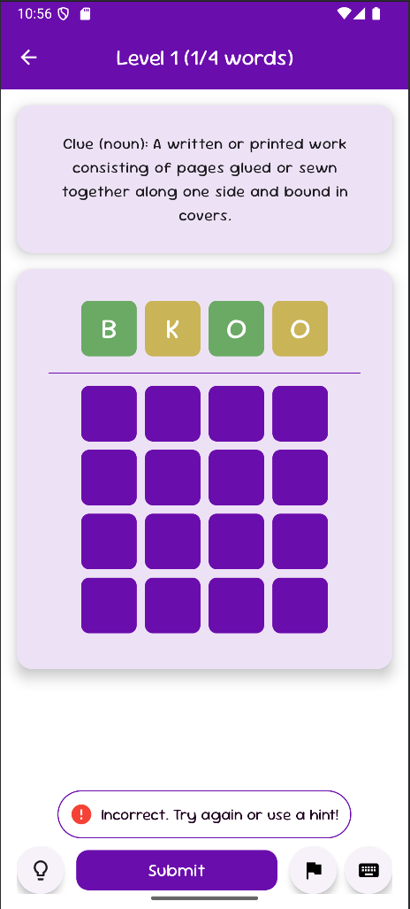 | 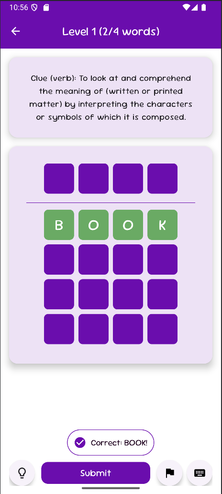 |

| Gameplay - Hint Used                         | Gameplay - Keyboard Active                   | Post-Level - Word Meanings                  |
| :-------------------------------------------: | :------------------------------------------: | :------------------------------------------: |
| 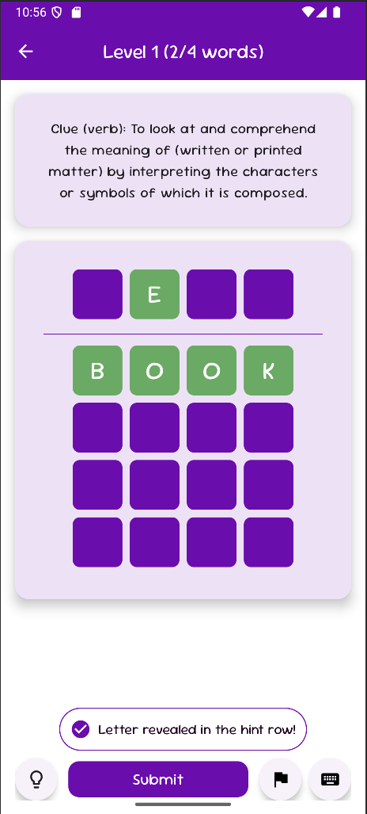| 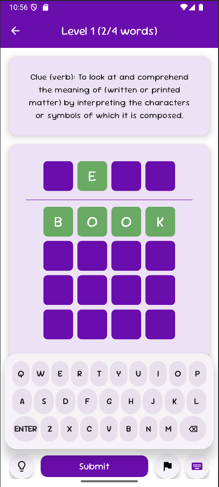 | 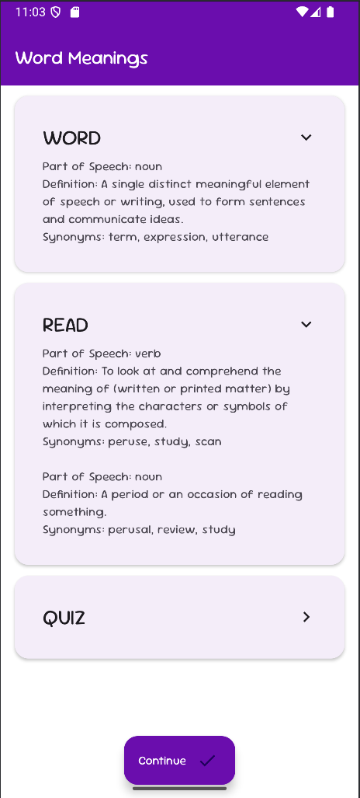 |

## 🎮 How to Play

1.  **Start a Game:** Navigate to a level or start a new game from the home screen.
2.  **Read the Clue:** Each word comes with a clue, often including its part of speech (noun, verb, etc.) and definition.
3.  **Guess the Word:** Type your guess using the on-screen keyboard.
4.  **Submit:** Press 'Submit' to check your answer.
    *   **Green:** Correct letter in the correct position.
    *   **Yellow:** Correct letter in the wrong position.
    *   **Gray/Default:** Letter not in the word.
5.  **Use Hints:** If you're stuck, you can use up to 3 hints per word, which will reveal a letter in its correct position.
6.  **Give Up (Optional):** If you can't figure out a word, you can choose to give up and see the answer.
7.  **Learn:** After a word is revealed (either by guessing, hints, or giving up), you'll have the option to learn more about it – its meaning, synonyms, and how it's used in different contexts.
8.  **Advance:** Complete all words in a level to move to the next.

## 🧠 Educational Goal

Lexify's core idea is to educate users on the meaning of words. If players use hints or give up on a word, they are encouraged to explore:
*   **Definitions:** Clear explanations of what the word means.
*   **Synonyms:** Words with similar meanings.
*   **Contextual Examples:** How the word is used in sentences.

This approach aims to turn a fun game into a valuable learning tool.

## 🛠️ Technology Stack

*   **Platform:** Android
*   **IDE:** Android Studio
*   **Language:** Java
*   **UI:** XML Layouts

## 🚀 Future Enhancements

*   Expanded word database and more levels.
*   More diverse clue types.
*   Advanced game settings and themes.
*   Leaderboards and social sharing.
*   Daily challenges.
*   Pronunciation guides for words.

**Version:** 1.0

---

Feel free to contribute, report bugs, or suggest features!
